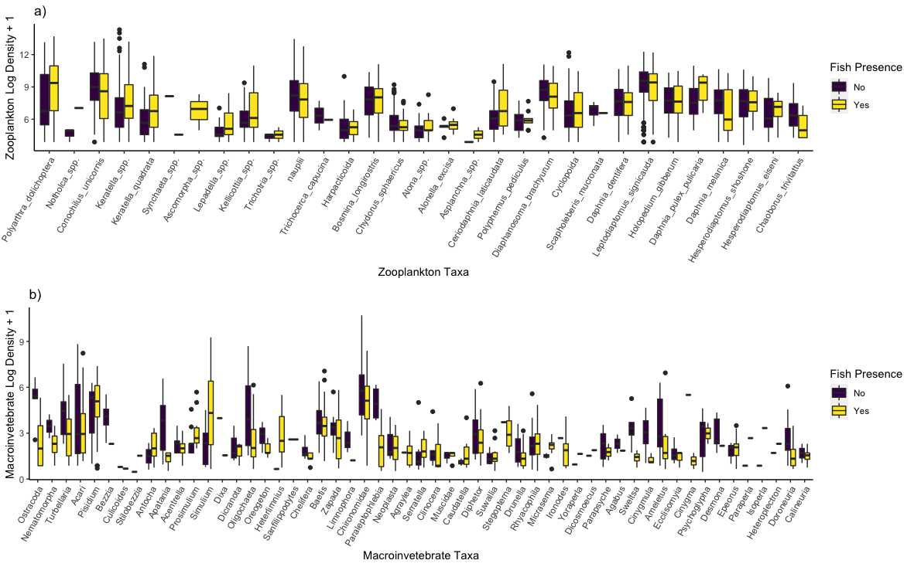
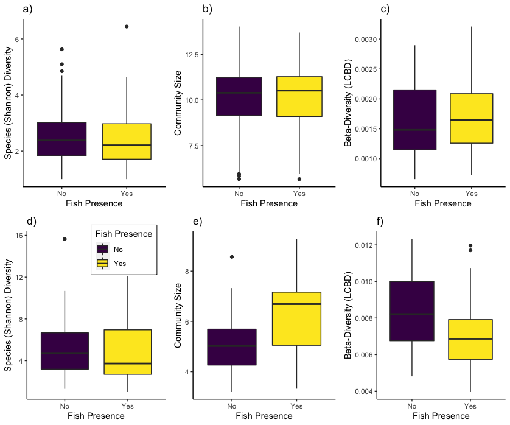
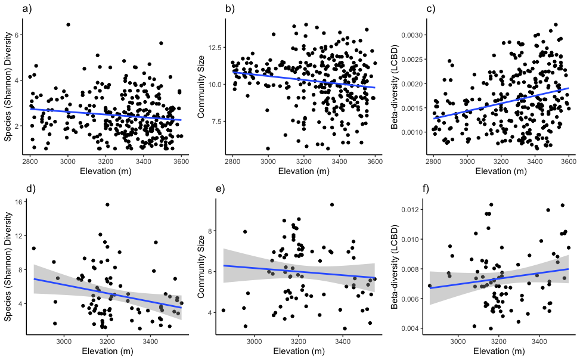
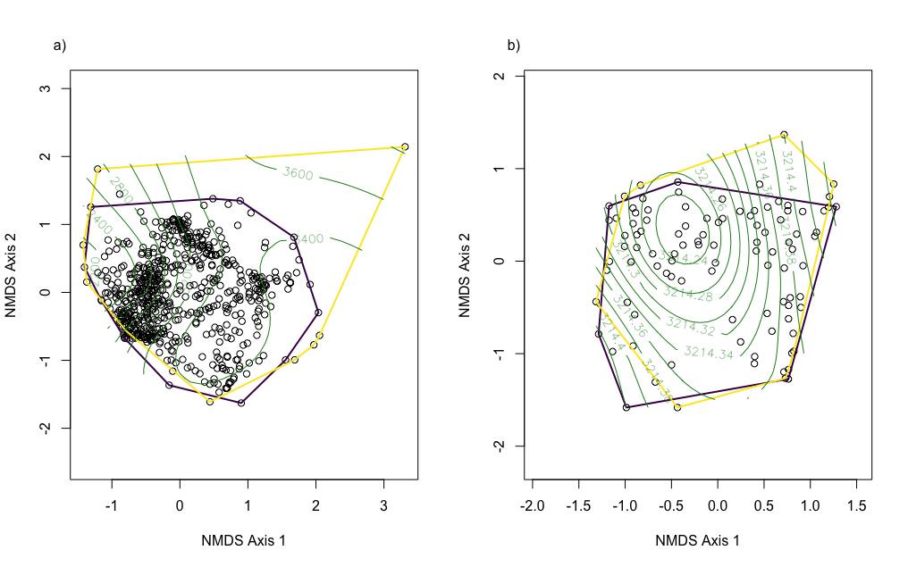
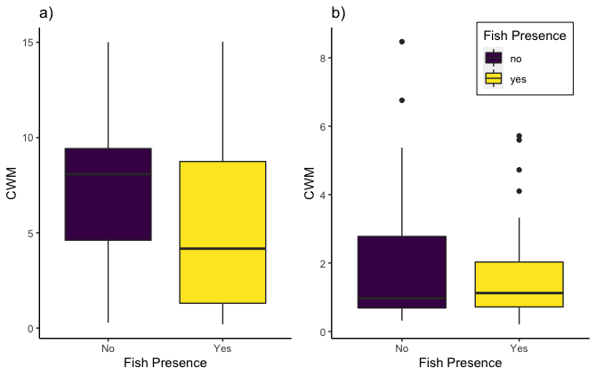
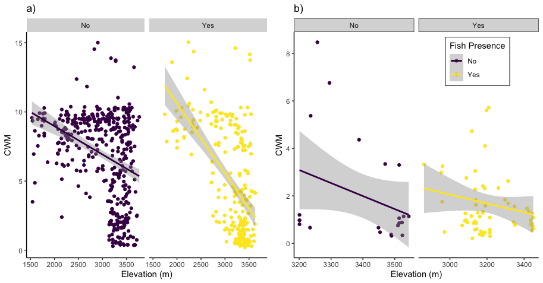
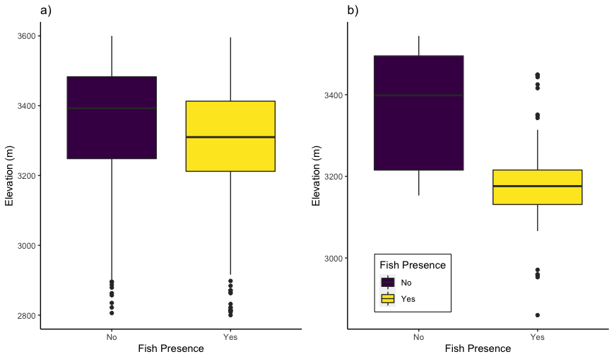

# Chapter3

Title: Effects of fish on stream macroinvertebrate and lake zooplankton communities

Status of MS: In Prep

Authors: Matthew D. Green, David B. Herbst, and Kurt E. Anderson

# Structure of Code

1) Stream.Analysis.R  stream analysis
2) Plotting.R makes all figures used in the manuscript 
3) Stream.Analysis.R Lake anlyses and organize code

# Data

1) Data Availability: Zooplankton data (Knapp et al. 2020) used in this study can be accessed from Environmental Data Initiative at https://portal.edirepository.org/nis/mapbrowse?scope=edi&identifier=577&revision=2. 

2) Macroinvertebrate data (Green et al. 2022) can be accessed from Dryad at https://doi.org/10.5061/dryad.2fqz612qw.

# Results

### Fig 1: Individual zooplankton (a) and macroinvertebrate (b) species responses to fish presence. Only species that occur in both fish and fishless sites are included in this figure. The order of each x-axis is based on average body size, from smallest to largest species.

### Fig 2: Zooplankton (a-c) and macroinvertebrate (d-f) community diversity response as a function of fish presence.

### Fig 3: Zooplankton (a-c) and macroinvertebrate (d-f) community diversity along an elevational gradient.

### Fig 4:  Ordination of zooplankton  (a) and macroinvertebrate (b) species from Sierra Nevada, CA as a function  of  fish and elevation

### Fig 5: CWM of zooplankton (a) and macroinvertebrate (b) community biomass as a function of fish presence.

### Fig 6: CWM of zooplankton (a) and macroinvertebrate (b) community biomass along an elevational gradient.

### Fig 7: Beta diversity of zooplankton (a) and macroinvertebrate (b) communities as a function of fish.

# Supplemental

### Fig S1: Fish presence as a function of elevation (m) for lakes and streams.

